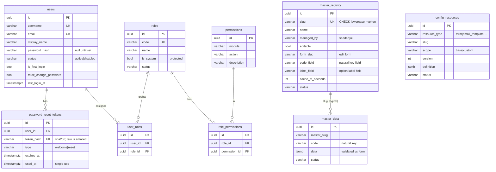

# Data Model

The Postgres schema as of Phase 1 + the post-Phase-1 batches. Schema is
**migration-driven** (TypeORM `synchronize` is always off). Entities are decorator
classes co-located in their module as `*.entity.ts` and registered explicitly in
[`backend/src/db/entities.ts`](../backend/src/db/entities.ts); DDL lives in
[`backend/src/db/migrations/`](../backend/src/db/migrations/).

Every table extends a common base (`BaseEntity`):

| Column | Type | Notes |
|---|---|---|
| `id` | uuid | PK, `gen_random_uuid()`/`uuid_generate_v4()` |
| `createdAt` / `updatedAt` | timestamptz | audit timestamps |
| `deletedAt` | timestamptz null | soft delete |

## ER diagram

## Tables by domain

### Configurable resources
- **`config_resources`** — backs the generic config-resolution pipeline. One row per
  `(resource_type, slug, scope)`. `scope=base` is shipped, `scope=custom` is the client
  override; the resolver returns `deepMerge(base, override)`. Forms and email templates
  are both `resource_type`s here. Unique: `(resource_type, slug, scope)`.

### Auth & access
- **`users`** — identity + credentials + status. `password_hash` is null until the user
  sets a password via the welcome/reset flow.
- **`password_reset_tokens`** — single-use, expiring, hashed tokens for welcome + forgot
  flows. FK `user_id → users` (ON DELETE CASCADE).
- **`permissions`** — grantable `(module, action)` capabilities. Unique `(module, action)`.
- **`roles`** — deployment roles; `is_system` roles (admin/viewer) are protected.
- **`role_permissions`** — role↔permission, unique `(role_id, permission_id)`, both FKs CASCADE.
- **`user_roles`** — user↔role, unique `(user_id, role_id)`, both FKs CASCADE.

> Sessions are **not** a table — they live in Redis (`sess:{id}` + a per-user index set),
> carrying the effective permission snapshot, for immediate revocation.

### Masters
- **`master_registry`** — describes each master: seeded (read-only) vs UI-managed, the
  `form_slug` that edits it, and `code_field`/`label_field` (which data fields are the
  natural key and the option label). Slug naming enforced by a CHECK constraint.
- **`master_data`** — generic row store for **all** masters, keyed by `master_slug`. Full
  row in `data` (jsonb, validated against the master's form on write); `code` is the
  natural key, unique within a master. Linked to `master_registry` by slug (logical, not a FK).

### Internal
- **`schema_migrations`** — TypeORM migration ledger.

## Adding an entity

1. Create `*.entity.ts` in the module (extend `BaseEntity`).
2. Add it to [`src/db/entities.ts`](../backend/src/db/entities.ts).
3. `npm run migration:generate -- src/db/migrations/<Name>` → review → `npm run migration:run`.
