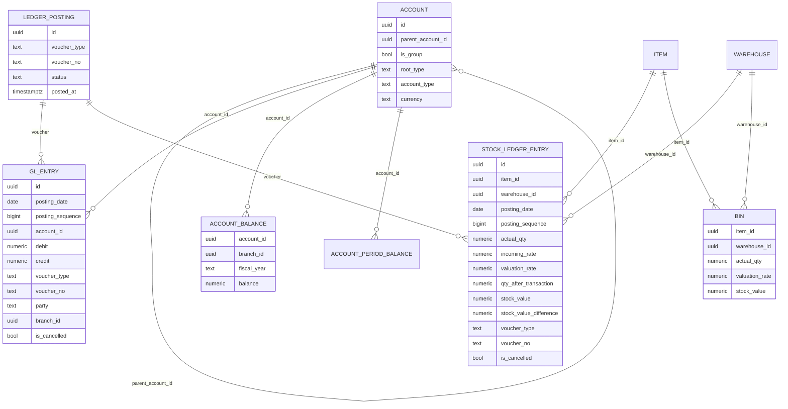

# Ledger & Reports — Implementation Plan (Brainstorm)

> Status: **design / brainstorm only — nothing implemented yet.**
> Scope of this round: **Stock Ledger** and **Account (Financial) Ledger**, plus the
> reporting engine that reads them. Other sub-ledgers (payroll, fixed assets, tax)
> reuse the same machinery later.
>
> This document is the thinking *before* code: the principles, the data model, the
> hard parts, the technology choices, and the decisions we still need to make.

---

## 1. Why this is the riskiest part of the ERP

Forms, masters and documents are *state you edit*. A ledger is *history you can never
edit*. Money and stock are where bugs become **financial discrepancies an auditor
finds months later**, so the design constraints are different from everything we've
built so far:

- The numbers must reconcile **to the cent / to the unit**, forever.
- Entries are **immutable** — you correct with new entries, never an `UPDATE`.
- A single business action (e.g. "submit Purchase Invoice") must post to **two
  ledgers atomically** (stock + financial) or not at all.
- The same action must be **idempotent** — a retry or a double-click must not
  double-post.
- Reports over millions of rows must stay **fast**.

The single biggest source of real-world ERP ledger bugs (confirmed across ERPNext's
issue tracker) is **back-dated / out-of-order entries forcing a "repost"** of every
later entry's running balance and valuation. We design for that from day one rather
than bolting it on.

This matches the locked project decision: the **generic append-only balanced posting
engine (§5.11) is a load-bearing abstraction — build it generic from the start**,
STOCK first, FINANCIAL next. (See [erp-project-overview].)

---

## 2. First principles (the invariants the engine guarantees)

These hold for **every** ledger built on the engine:

1. **Append-only / immutable.** Entry tables only ever get `INSERT`s. No `UPDATE`,
   no `DELETE`. The *only* mutable rows are the **balance caches** (current balance
   per account / per item×warehouse), which are derived and can always be rebuilt
   from the entries.
2. **Idempotent posting.** Every posting carries a unique `(voucher_type, voucher_no,
   purpose)` key. Re-posting the same key is a no-op (or a checked error), never a
   duplicate. Survives worker retries and double-submits.
3. **Atomic & balanced per voucher.** All entries for one business event are written
   in **one DB transaction**. The financial ledger additionally enforces
   `Σ debit = Σ credit = 0` for that voucher before commit. Partial posts are
   impossible.
4. **Deterministically ordered.** Entries are ordered by `(posting_date,
   posting_sequence)` so running balances and FIFO valuation are reproducible — even
   when entries arrive out of order.
5. **Repostable.** Inserting a back-dated entry marks all later entries for that key
   "dirty"; a background job recomputes their running balance / valuation forward and
   refreshes the balance cache. The entries' *amounts* never change — only the
   derived `balance_after` columns.
6. **Reversible, not editable.** "Cancel" / "correct" = post an equal-and-opposite
   reversing voucher, linked to the original. The original stays in history.

> **Nuance on "balanced":** the *financial* ledger's invariant is `debit = credit`.
> The *stock* ledger's invariant is *valuation consistency* (`balance_value` always
> equals the sum of remaining FIFO layers / moving-average value). They are different
> invariants, so we keep **two concrete entry tables** but share invariants #1, #2,
> #4, #5, #6 and the posting/repost machinery. Forcing a single table (à la "one
> ledger to rule them all") is the over-abstraction trap — ERPNext keeps Stock Ledger
> Entry and GL Entry separate for exactly this reason.

---

## 3. Architecture overview

```
            DOCUMENTS (Purchase Invoice, Payment, Stock Entry, Delivery …)
                              │  on workflow transition (Submit / Approve)
                              ▼
                   ┌─────────────────────────┐
                   │   POSTING SERVICE        │   config-driven posting rules:
                   │  (one DB transaction)    │   "which doc → which ledger lines"
                   └───────────┬─────────────┘
            ┌──────────────────┴───────────────────┐
            ▼                                       ▼
   ┌──────────────────┐                   ┌──────────────────────┐
   │  STOCK LEDGER    │  perpetual link   │  FINANCIAL LEDGER    │
   │  stock_ledger_   │ ────────────────► │  gl_entry            │
   │  entry  + bin    │  (value Δ posts   │  + account_balance   │
   │  (qty+valuation) │   a balanced GL)  │  (debit/credit)      │
   └────────┬─────────┘                   └──────────┬───────────┘
            │                                        │
            └──────────────┬─────────────────────────┘
                           ▼
                 SHARED ENGINE PRIMITIVES
   idempotency · sequencing · atomic txn · repost worker (BullMQ) ·
   balance-cache pattern · reversal/cancel · advisory-lock serialization
                           │
                           ▼
                    REPORTING ENGINE
   3 tiers: balance cache (instant) · live ledger query w/ window fns ·
   aggregated reports (materialized views / snapshots) → ag-grid + export
```

The **Posting Service** is the only writer. Everything else reads. Documents never
touch ledger tables directly — they call the posting service with a typed payload.

---

## 4. Account (Financial) Ledger

### 4.1 Chart of Accounts (tree)

Classic ERP pattern: a tree of **Group** nodes and **Ledger** leaves. **Postings are
only allowed against leaf ledger accounts**, never groups (groups are roll-up only).

- Store as an `account` table with `parent_account_id` (adjacency list) + a
  materialized `lft/rgt` or `path` for fast subtree roll-ups (nested-set or
  `ltree`). For our scale, adjacency list + a cached `path` string is enough; add a
  recursive CTE for roll-ups.
- Each account has a **root type**: Asset / Liability / Equity / Income / Expense
  (drives the accounting equation and which report it lands in), plus `is_group`,
  `account_type` (Bank, Receivable, Payable, Stock, Tax, COGS, …), and `currency`.
- The **Chart of Accounts is config** — ship a base CoA per country/template in
  `config_resources` (resourceType `chart_of_accounts`), let clients override. Same
  base→override deep-merge we already use for forms.

### 4.2 `gl_entry` (the financial ledger)

Append-only. One business event → ≥2 rows that net to zero.

| column | type | notes |
|---|---|---|
| `id` | uuid | |
| `posting_date` | date | the accounting date (can be back-dated) |
| `posting_sequence` | bigint | global monotonic tiebreaker for same-date ordering |
| `account_id` | uuid → account | leaf only |
| `debit` | numeric(21,6) | one of debit/credit is 0 |
| `credit` | numeric(21,6) | |
| `against_account` | text | the "other side" summary (for the GL report) |
| `voucher_type` | text | `PurchaseInvoice`, `Payment`, `StockEntry`, `JournalEntry` … |
| `voucher_no` | text | the document code (links lineage) |
| `party_type` / `party` | text | Customer/Supplier/Employee (for AR/AP sub-ledgers) |
| `branch_id` | uuid | our existing org dimension |
| `cost_center_id` | uuid? | optional accounting dimension |
| `project_id` | uuid? | optional dimension |
| `fiscal_year` | text | denormalized for partition/filter |
| `is_cancelled` | bool | set when a reversing voucher is posted (still no row edit of amounts) |
| `remarks` | text | |
| `created_at` | timestamptz | |

**Invariant enforced in the posting txn:** `Σ debit = Σ credit` across all rows of a
voucher. Reject otherwise.

**Indexes:** `(account_id, posting_date, posting_sequence)`, `(voucher_type,
voucher_no)`, `(party_type, party)`, `(branch_id, fiscal_year)`, partial index on
`is_cancelled = false`.

### 4.3 Balance cache & period snapshots

Computing a balance by `SUM`-ing all history every time is what kills ERP reports.
Two complementary caches (the Square "Books" pattern: *cache the balance on the row,
update on each post*):

- **`account_balance`** — current running balance per `(account_id, branch_id,
  fiscal_year)`: `debit_total`, `credit_total`, `balance`. Updated inside the posting
  txn. Gives **instant** "what's the balance of Cash now".
- **Period snapshots** (`account_period_balance`) — opening + closing balance per
  `(account, fiscal_period)`. Written at period close (or lazily). Makes Trial
  Balance / P&L for *any* historical period O(accounts) instead of O(entries): a
  period report = `opening snapshot + movements within period`.

Both are **derivable** — a "rebuild balances" job can always reconstruct them from
`gl_entry`, which is the safety net for invariant #1.

### 4.4 Fiscal year, periods, closing

- `fiscal_year` (start/end, can be non-calendar) and `fiscal_period` (months/quarters)
  as masters/config.
- **Period close** = freeze postings ≤ a date (config flag) + write period snapshots.
- **Year-end closing** = a system-generated Journal Entry that zeroes Income/Expense
  into Retained Earnings. This is itself just a voucher through the posting service.

### 4.5 Dimensions

`branch_id` (we already have it), plus optional `cost_center`, `project`,
accounting dimensions. Model them as **nullable FK columns now** (cheap) even if the
UI exposes only branch first — adding a dimension column later is an additive
migration, but back-filling historical entries is not, so reserve the columns early.

---

## 5. Stock Ledger

### 5.1 `stock_ledger_entry` (SLE)

Append-only quantity+valuation ledger, one row per item movement per warehouse.

| column | type | notes |
|---|---|---|
| `id` | uuid | |
| `item_id` | uuid → item | |
| `warehouse_id` | uuid | (or `branch_id` if warehouse == branch initially) |
| `posting_date` | date | back-datable |
| `posting_sequence` | bigint | ordering tiebreaker |
| `actual_qty` | numeric(21,6) | +receipt / −issue |
| `incoming_rate` | numeric(21,6) | unit cost of a receipt (0 for issues) |
| `valuation_rate` | numeric(21,6) | running unit valuation after this entry |
| `qty_after_transaction` | numeric(21,6) | **running balance qty** |
| `stock_value` | numeric(21,6) | **running balance value** |
| `stock_value_difference` | numeric(21,6) | value Δ this entry → feeds the GL post |
| `fifo_queue` | jsonb? | FIFO layers `[[qty, rate], …]` snapshot (FIFO only) |
| `voucher_type` / `voucher_no` | text | source document |
| `branch_id` | uuid | |
| `is_cancelled` | bool | |
| `created_at` | timestamptz | |

This mirrors ERPNext's SLE (`actual_qty`, `qty_after_transaction`, `valuation_rate`,
`stock_value`, `stock_value_difference`) — a proven shape.

### 5.2 `bin` (stock balance cache)

Current balance per `(item, warehouse)`: `actual_qty`, `valuation_rate`,
`stock_value`, plus `reserved_qty` / `ordered_qty` / `projected_qty` later. Updated
in the posting txn. This is the instant "how much do I have" lookup; the SLE is the
history.

### 5.3 Valuation methods

- **Moving Average** (recommended first — simpler, no per-layer state):
  on each receipt, `new_value = old_value + qty_in × rate_in`;
  `valuation_rate = new_value / new_qty`. Issues leave the rate unchanged.
- **FIFO** (later): maintain a queue of `[qty, rate]` layers; an issue consumes from
  the front; `valuation_rate` = value of remaining layers / remaining qty. Store the
  queue snapshot in the SLE (`fifo_queue` jsonb) so repost can resume from any point.

Valuation method is **per-item config** (default from item group / global setting).

### 5.4 Perpetual inventory → GL link

When a stock movement changes value (`stock_value_difference ≠ 0`), the **same
posting transaction** writes a balanced GL pair:

```
Material Receipt of value V:
   Dr  Stock-in-Hand (asset)      V
   Cr  Stock Received / GR-IR     V
Material Issue (e.g. delivery, COGS):
   Dr  Cost of Goods Sold         V
   Cr  Stock-in-Hand              V
```

The account mapping (which warehouse → which stock account, which expense → COGS) is
**config** (a "stock posting profile"). This is what makes inventory and accounting
reconcile automatically (perpetual inventory). Periodic inventory (no auto-GL) is a
config toggle if a client wants it.

---

## 6. The posting layer (documents → ledgers)

### 6.1 When postings happen

Hooked onto the **workflow engine** we already built: a document posts to the ledgers
on a configured **state transition** (typically `Submit`/`Approve` → posts; a
`Cancel` transition → reverses). The trigger is config, consistent with the rule
engine.

### 6.2 Config-driven posting rules

A `posting_rule` config (per `voucher_type`) declares how to turn a document into
ledger lines — e.g. for a Purchase Invoice:

```jsonc
{
  "voucherType": "purchase-invoice",
  "trigger": { "transition": "Submit", "reverseOn": "Cancel" },
  "gl": [
    { "account": "{expenseAccount}",   "debit": "{netTotal}" },
    { "account": "{taxAccount}",       "debit": "{taxTotal}" },
    { "account": "creditors/{vendor}", "credit": "{grandTotal}", "party": "{vendor}" }
  ],
  "stock": [
    { "item": "{line.item}", "warehouse": "{warehouse}", "qty": "{line.qty}",
      "rate": "{line.rate}", "direction": "in" }
  ]
}
```

The posting service resolves the placeholders from the document, builds the typed
payload, validates the balanced invariant, and writes everything in **one
transaction**. Keeping this as config (not hardcoded per doctype) is the same
philosophy as forms/workflows and lets clients add accounts/dimensions without code.

> **Decision point:** config-as-mapping (above) vs. a small pluggable TypeScript
> "poster" per voucher type. Recommendation: **config for the common 80%**, with an
> escape hatch to a named TS poster for complex cases (e.g. landed-cost
> apportionment). Don't put arbitrary expressions in JSON — use a small,
> whitelisted resolver (field refs + a few functions), not `eval`.

### 6.3 Idempotency & atomicity (the non-negotiables)

- One `BEGIN … COMMIT` wraps: GL inserts + SLE inserts + bin update + account_balance
  update + the document's "posted" flag.
- A unique constraint on `(voucher_type, voucher_no, purpose)` (or a `ledger_posting`
  header row) makes re-posting a hard no-op.
- Serialize concurrent posts to the *same key* (same account / same item×warehouse)
  with a **Postgres advisory lock** (or `SELECT … FOR UPDATE` on the bin /
  account_balance row) so two simultaneous posts can't both read the same opening
  balance.

---

## 7. The hard parts (design for them now)

### 7.1 Back-dated entries & the repost engine

The #1 real-world ledger bug. When an entry is inserted with a `posting_date` earlier
than existing entries for the same key:

1. Compute `posting_sequence` so it slots into the correct position.
2. Mark all later entries for that `(account)` / `(item, warehouse)` **dirty**.
3. Enqueue a **BullMQ repost job** that walks the later entries in order and
   recomputes `balance_after` / `valuation_rate` / `qty_after_transaction` forward,
   then refreshes the balance cache and any affected period snapshots.
4. The entries' *amounts/qty* never change — only derived columns. Still
   "append-only" in spirit (we touch derived caches, not the immutable facts).

Make repost **chunked & resumable** (ERPNext's repost famously hangs on big batches).
Lock the key during repost. Surface a "stock/ledger variance" report to detect any
cache vs. recomputed mismatch.

> Cheaper alternative to confirm with the user: **disallow back-dating** (postings
> must be ≥ last posting date for that key, or only via an explicit "stock/ledger
> reconciliation" voucher). This removes the entire repost engine. Most pain in
> ERPNext comes from allowing arbitrary back-dating — worth deciding deliberately.

### 7.2 Deterministic ordering

Same `posting_date` can hold many entries. Order by an explicit `posting_sequence`
(global bigint sequence, or per-key counter). Never rely on `created_at` or insertion
order alone.

### 7.3 Cancellation & reversal (immutability)

No edits, no deletes. Cancel = post a linked reversing voucher (negate debit/credit,
negate qty). Editing a submitted document = cancel + amend (new version, new voucher
no, link to the cancelled one). The audit trail shows the whole story.

### 7.4 Negative stock

Issuing more than on-hand → either **block** (default) or **allow** (config flag,
needed for some flows). If allowed, valuation of a negative balance needs a defined
rule (use last valuation rate). Decide per the client; expose as a setting.

### 7.5 Money & quantity representation (technology decision)

Floating point is **out** — it's the root of ERPNext's "stock value differs from GL"
class of bugs. Two viable choices:

- **`NUMERIC(21,6)` in Postgres + a decimal lib (`decimal.js`/`big.js`) in Node** —
  exact decimal, human-readable, easy reporting. **Recommended.** Pick scale per
  use (amounts 2–6 dp, qty up to 6 dp, rates 6 dp) and a consistent rounding policy.
- Integer **minor units** (store cents/paise as bigint) — fastest/safest for pure
  money but awkward for multi-precision qty and rates. Overkill here.

Define a single rounding policy (banker's vs half-up) and round **once** at
document-total level, then derive — never accumulate rounding across lines.

### 7.6 Concurrency

Advisory locks / row locks per key during post+repost (see §6.3). Postings are
low-frequency relative to reads, so a per-key serialize is fine and avoids races on
the running balance.

---

## 8. Reporting engine

### 8.1 Three tiers (use the cheapest that answers the question)

| Tier | For | Mechanism | Latency |
|---|---|---|---|
| **1. Balance cache** | "current balance of X" | read `account_balance` / `bin` | instant |
| **2. Live ledger query** | General Ledger, Stock Ledger (a list w/ running balance) | indexed query on `gl_entry`/`stock_ledger_entry` + **window function** running total, paginated | ms–100s ms |
| **3. Aggregated report** | Trial Balance, P&L, Balance Sheet, Stock Balance, Aging | period snapshots / **materialized views**, refreshed on close or on demand, Redis-cached by params | cached → instant; cold → seconds |

Running balance via window function (no app-side loop):

```sql
SELECT posting_date, debit, credit,
       SUM(debit - credit) OVER (PARTITION BY account_id
                                 ORDER BY posting_date, posting_sequence) AS balance
FROM gl_entry
WHERE account_id = $1 AND posting_date BETWEEN $2 AND $3
ORDER BY posting_date, posting_sequence;
```

Trial Balance for a period = `opening snapshot + Σ movements in period` per account
(roll up groups with a recursive CTE over the account tree). Materialize it if it's
hit constantly; otherwise the snapshot makes it cheap enough live.

### 8.2 Reports as configuration

Reports should be **config like forms/workflows**, not bespoke components. A
`report_definition` (`config_resources` resourceType `report`) declares:

- `source`: a **whitelisted** view / named query id (NOT raw SQL from config — that's
  an injection surface). The query lives in code; config picks which one + params.
- `filters`: typed params (date range, account, branch, item, warehouse…).
- `columns`: keys, labels, format (currency/qty/date), alignment — reuse the
  list-view column machinery we just built.
- `grouping` / `totals` / `drilldown` target (click a GL line → open the voucher).
- `permission`: RBAC key (reuse our module:action ACL).

Server endpoint: `POST /api/reports/:slug/run` → params in, rows + totals out
(paginated / streamed for big exports). Frontend renders with **ag-grid** (grouping,
column state, CSV export built in). Note: ag-grid **community** has grouping/sorting
but **not pivot/range** — if we need pivot tables, either server-side pivot or
ag-grid Enterprise (licensing decision).

### 8.3 The core reports (first cut)

**Financial:** General Ledger (per account, running balance) · Trial Balance ·
Profit & Loss · Balance Sheet · Accounts Receivable / Payable (party-wise outstanding
+ ageing) · Journal Entry / voucher list · Cash/Bank book.

**Stock:** Stock Ledger (per item×warehouse, running qty+value) · Stock Balance
(current on-hand & value) · Stock Ageing · Stock Valuation · Item-wise movement ·
(later) Reorder / projected qty.

### 8.4 Performance & ops

- Indexes per §4.2/§5.1; consider **partitioning** `gl_entry`/`stock_ledger_entry`
  by `fiscal_year` (and/or `branch_id`) once volume is real — keeps reports and
  reposts scoped.
- **Materialized views** for the heaviest aggregates; refresh via a **BullMQ**
  scheduled job (`REFRESH MATERIALIZED VIEW CONCURRENTLY`) and/or on period close.
- **Redis cache** report results keyed by `(slug, params, last_posting_seq)` — bust
  automatically when a new posting bumps the sequence, so cached reports are never
  stale.
- Stream large exports (CSV) rather than buffering.

---

## 9. Technology choices & trade-offs (summary)

| Concern | Choice | Why / trade-off |
|---|---|---|
| Money/qty type | `NUMERIC(21,6)` + `decimal.js` | exact decimal; avoids float drift. Slower than int but correct & readable. |
| Storage | Postgres (existing) | window fns, recursive CTEs, materialized views, advisory locks, partitioning — everything we need. No new datastore. |
| Account tree | adjacency list + cached path / recursive CTE (or `ltree`) | simple; fast roll-ups. Nested-set only if tree churns rarely and roll-ups dominate. |
| Balance speed | cached balance rows + period snapshots | O(1) current balance, O(accounts) period reports; always rebuildable. |
| Async work | BullMQ worker (existing) | repost jobs, mat-view refresh, period close, heavy exports — off the request path. |
| Report cache | Redis (existing) keyed by posting sequence | instant repeat reports, auto-busted on new posts. |
| Report grid | ag-grid (existing) | grouping/sort/CSV built in; pivot needs Enterprise or server-side. |
| Validation/types | Zod (existing) | one schema for posting payloads + report definitions, like everywhere else. |
| Config | `config_resources` base→override | CoA, posting rules, stock profiles, report defs all ship as config + client overrides. |
| Migrations | TypeORM migrations (authoritative) | new tables/indexes; never `synchronize`. |

Nothing here adds a new technology — it's all Postgres + Redis + BullMQ + Zod +
ag-grid we already run. The hard part is **discipline** (immutability, atomicity,
repost), not infrastructure.

---

## 10. Data model sketch (ERD)



`LEDGER_POSTING` is the idempotency header (one per posted voucher) that both entry
tables point back to.

---

## 11. Phased roadmap (suggested)

1. **Engine core.** `ledger_posting` header + posting service skeleton (idempotency,
   atomic txn, sequencing, advisory-lock), reversal, the balance-cache pattern.
   Decide back-dating policy (§7.1) — gates whether the repost engine is in v1.
2. **Stock ledger (first, per the locked plan).** `stock_ledger_entry` + `bin`,
   Moving Average valuation, warehouse master, Stock Entry document → posting rule.
   Reports: Stock Ledger + Stock Balance.
3. **Financial ledger.** `account` (CoA tree) + base CoA config, `gl_entry` +
   `account_balance`, Journal Entry document, balanced invariant. Reports: General
   Ledger + Trial Balance.
4. **Perpetual link.** Wire stock value Δ → GL via stock posting profile; reconcile
   stock value vs GL stock account.
5. **Document posting rules.** Purchase Invoice / Payment / Delivery → config-driven
   postings on workflow transition.
6. **Reporting engine proper.** `report_definition` config, `/api/reports/:slug/run`,
   ag-grid report screens, period snapshots, P&L / Balance Sheet, AR/AP ageing,
   Redis caching + materialized views + export.
7. **Hardening.** Repost engine (if back-dating allowed), FIFO valuation, negative
   stock, multi-currency, period/year close, variance reports.

---

## 12. Decisions to confirm before building

These genuinely change the design — worth deciding up front:

1. **Back-dating:** allow arbitrary back-dated entries (→ build the repost engine), or
   restrict to forward-only + explicit reconciliation vouchers (→ much simpler v1)?
2. **Money representation:** `NUMERIC(21,6)` + decimal.js (recommended) vs integer
   minor units? And the rounding policy (half-up vs banker's, dp per field)?
3. **Valuation:** Moving Average first (recommended), FIFO later? Per-item or global?
4. **Inventory accounting:** perpetual (auto stock→GL, recommended) vs periodic
   (manual), and is it a per-client toggle?
5. **Multi-currency:** single base currency now with currency/rate columns reserved,
   or full multi-currency (revaluation, gain/loss) from the start?
6. **Dimensions:** which to reserve as columns now — branch (yes), cost center,
   project, custom accounting dimensions?
7. **Warehouse model:** separate `warehouse` master, or is "warehouse == branch" good
   enough for v1?
8. **Negative stock:** blocked by default, or allowed (and how to value it)?
9. **Posting rules:** config-mapping for the common case + named TS posters for
   complex ones (recommended) — confirm we're OK maintaining both.
10. **Period/year close:** do we need hard period locking + year-end closing JE in
    v1, or soft (report-only) periods first?
11. **ag-grid pivot:** is community (no pivot) acceptable, or do we budget for
    Enterprise / server-side pivot for analytical reports?
12. **Fiscal year:** calendar-year only first, or non-calendar fiscal years from the
    start?

---

## Sources

- [Square — *Books, an immutable double-entry accounting database service*](https://developer.squareup.com/blog/books-an-immutable-double-entry-accounting-database-service/) — immutable append-only schema, cached balances, reversal, idempotency.
- [Modern Treasury — *Data Immutability*](https://www.moderntreasury.com/learn/data-immutability) and [*Ledger Database*](https://www.moderntreasury.com/learn/ledger-database) — append-only ledger principles.
- [TigerBeetle — *Debit/Credit: The Schema for OLTP*](https://docs.tigerbeetle.com/concepts/debit-credit/) — double-entry as the OLTP schema.
- [ERPNext — Chart of Accounts](https://docs.frappe.io/erpnext/chart-of-accounts) & [`general_ledger.py`](https://github.com/frappe/erpnext/blob/develop/erpnext/accounts/general_ledger.py) — GL Entry / CoA tree model.
- [ERPNext — `stock_ledger_entry.py`](https://github.com/frappe/erpnext/blob/develop/erpnext/stock/doctype/stock_ledger_entry/stock_ledger_entry.py), [FIFO vs Moving Average valuation](https://docs.erpnext.com/docs/user/manual/en/calculation-of-valuation-rate-in-fifo-and-moving-average), [Stock Ledger report](https://docs.erpnext.com/docs/v12/user/manual/en/stock/stock-ledger) — SLE fields, valuation, Bin.
- [ERPNext — Stock Reposting / Variance](https://docs.frappe.io/erpnext/stock-reposting) & [Immutable Ledger](https://docs.erpnext.com/docs/user/manual/en/immutable-ledger-in-erpnext) — the back-dating/repost pain we design around.
- [PostgreSQL — Materialized Views](https://www.postgresql.org/docs/current/rules-materializedviews.html) — report aggregation/refresh.
- [freeCodeCamp — *Build a Bank Ledger in Go with PostgreSQL (double-entry)*](https://www.freecodecamp.org/news/build-a-bank-ledger-in-go-with-postgresql-using-the-double-entry-accounting-principle/) — practical Postgres double-entry posting.

[erp-project-overview]: ../ (project memory — generic append-only balanced posting engine, §5.11)
